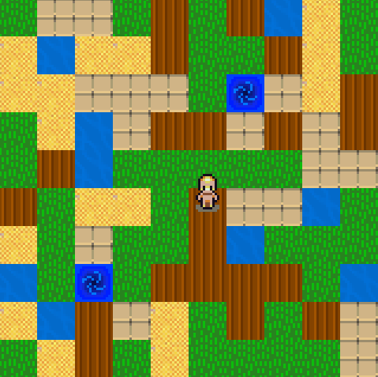

# S101 - implémentation d'un besoin client  : Project-quadtree
Code source pour le projet d'introduction au développement (R1.01) et de SAÉ implémentation d'un besoin client (SAE1.01), année 2023-2024.

**Groupe :** SOUCHET Thomas et LE CARLUER Brieuc

## Partie 5 - lecture de fichiers et quadtrees
Rendu le 15/12/2023, voir release "Partie 5"

## Partie 6 - les extensions
Rendu le 10/01/2024 voir release "Partie 6"

### Liste des extensions :
- 6.1 - Génération aléatoire de terrain
- 6.2 - Enregistrement d’un terrain
- 6.3 - Animation des décors
- 6.4 - Téléporteurs
- 6.5 - Interdiction de marcher sur l’eau
- 6.7 - Caméra plus précise
- 6.12 - Génération de terrain à la volée au fur et à mesure de l’exploration

### Indications pour l'utilisation des extensions :
**6.1 - Génération aléatoire de terrain :**

Pour l'activer, mettre le champ _Enabled_ de _RandomMap_ à True. La largeur et la hauteur du terrain généré peuvent être 
contrôlées par les champs _Width_ et _Height_. La gestion de la probabilité d'apparition d'un certain type de bloc peut 
se faire avec le tableau _BlockProbability_ (les probabilités sont données en pourcentage dans l'ordre des blocs).

**6.2 - Enregistrement d’un terrain :**

L'extension s'active avec le champ _SaveMap_, il est nécessaire d'utiliser la génération aléatoire et désactiver la
génération infinie. Les cartes sont sauvegardées dans un dossier _saved-maps_ qui sera créer.

**6.3 - Animation des décors :**

L'animation des décors s'active avec le champ _Enabled_ de _AnimatedWater_, les deux autres champs permettent de
configurer des caractéristiques de l'animation.

**6.4 - Téléporteurs :**

Les téléporteurs s'activent avec le champ _Enabled_ de _Teleporter_, les deux autres champs permettent de
configurer des caractéristiques de l'animation. Pour poser un téléporteur, il suffit d'appuyer sur la touche "T".

**6.5 - Interdiction de marcher sur l’eau :**

Pour interdire au joueur de marché sur l'eau, il faut mettre le champ _WaterWalk_ à False.

**6.7 - Caméra plus précise :**

Pour activer la caméra précise, il faut mettre le champ _CameraMode_ à 2 et il faut que le champ _Padding_ soit
supérieur ou égal à 1.

**6.12 - Génération de terrain à la volée au fur et à mesure de l’exploration :**

Cette extension s'active en mettant le champ _InfiniteMap_ à True et elle nécessite l'utilisation du quadtree 
(_FloorKind_ à 2) et l'activation de la génération aléatoire (_RandomMap_).

**_Capture d'écran du jeu_**

